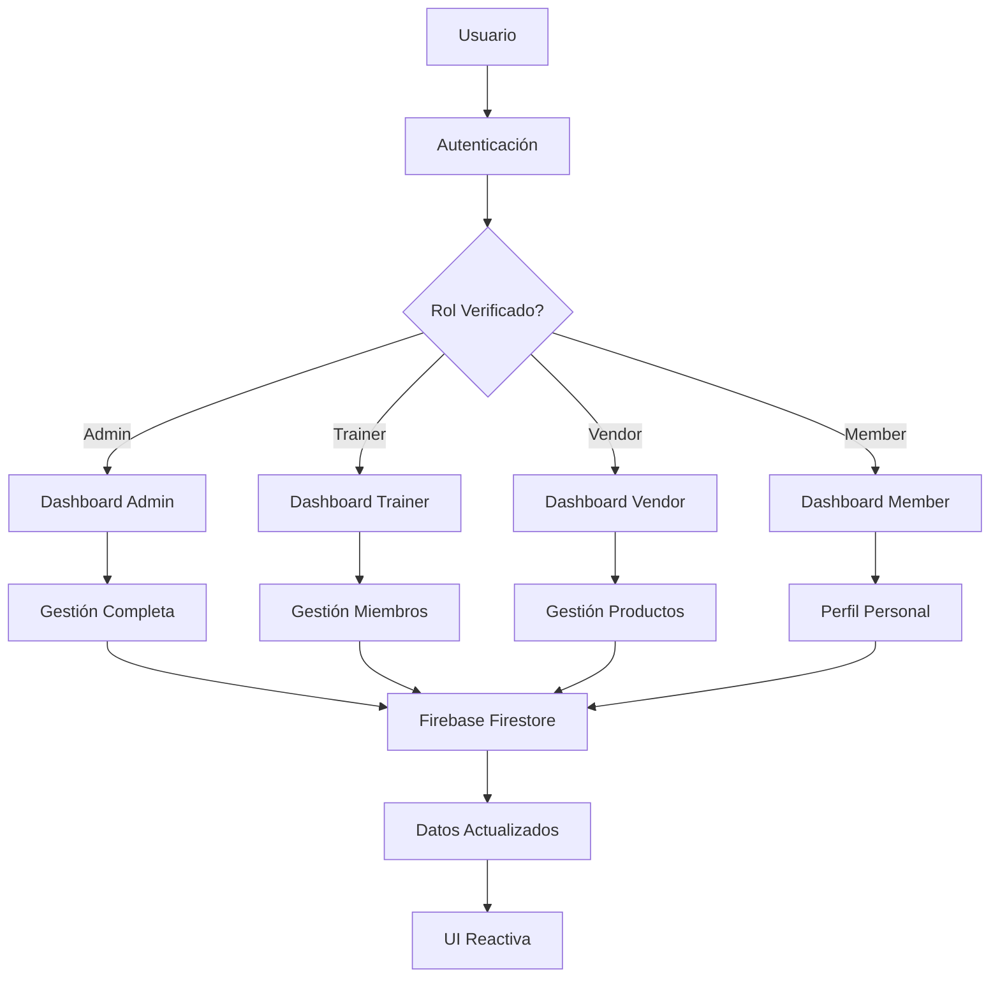
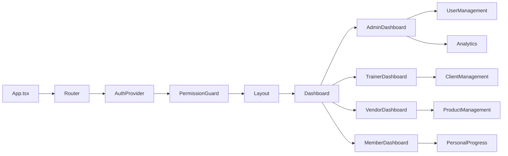
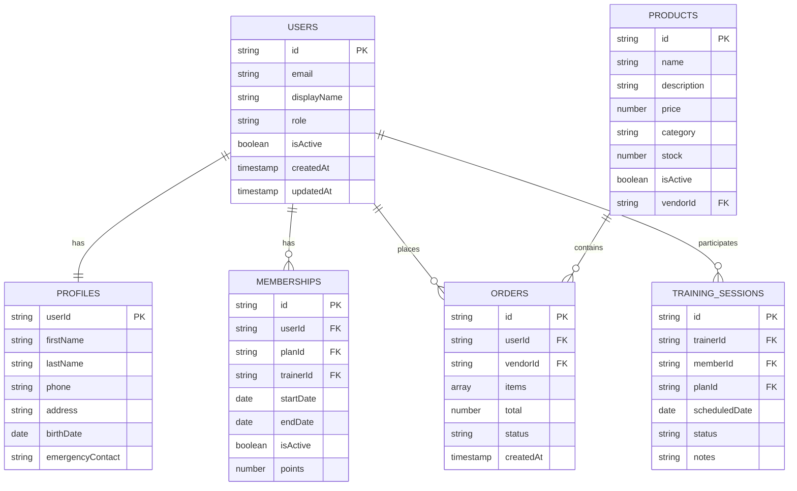

# 🏋️‍♂️ Documento Técnico - Sistema de Gestión de Gimnasio

## 📋 Índice

1. [Resumen Ejecutivo](#resumen-ejecutivo)
2. [Arquitectura Técnica](#arquitectura-técnica)
3. [Roles y Funcionalidades](#roles-y-funcionalidades)
4. [Matriz de Permisos](#matriz-de-permisos)
5. [Diagramas de Arquitectura](#diagramas-de-arquitectura)
6. [Guía de Implementación](#guía-de-implementación)
7. [Estrategias de Seguridad](#estrategias-de-seguridad)
8. [Plan de Testing y QA](#plan-de-testing-y-qa)
9. [Consideraciones de Escalabilidad](#consideraciones-de-escalabilidad)
10. [Documentación de APIs](#documentación-de-apis)

---

## 🎯 Resumen Ejecutivo

### **Objetivo del Sistema**
Desarrollar un sistema integral de gestión de gimnasio que permita la administración eficiente de miembros, entrenadores, vendedores y operaciones comerciales, con un enfoque en la experiencia del usuario y la escalabilidad.

### **Alcance del Proyecto**
- **Gestión de Usuarios**: 4 roles diferenciados (Admin, Trainer, Vendor, Member)
- **E-commerce**: Catálogo de productos, carrito de compras, procesamiento de pagos
- **Gestión de Membresías**: Planes, asignaciones, seguimiento de puntos
- **Analytics**: Dashboards personalizados por rol con métricas relevantes
- **Seguridad**: Sistema de permisos granular y auditoría completa

### **Tecnologías Core**
- **Frontend**: React 19.2.0 + TypeScript 5.2.2
- **Build Tool**: Vite 7.1.10
- **Styling**: Tailwind CSS 3.4.18
- **Backend**: Firebase 12.4.0 (Auth + Firestore + Storage)
- **Estado Global**: Zustand 4.5.7
- **Testing**: Vitest 1.6.1 + Testing Library
- **Linting**: ESLint 8.55.0

---

## 🏗️ Arquitectura Técnica

### **Arquitectura General**

```
┌─────────────────────────────────────────────────────────────────┐
│                    🌐 FRONTEND LAYER                            │
├─────────────────────────────────────────────────────────────────┤
│  ┌─────────────┐  ┌─────────────┐  ┌─────────────┐  ┌─────────┐ │
│  │   📱 UI     │  │  🎯 Pages   │  │ 🔧 Services │  │ 📊 Store│ │
│  │ Components  │  │ & Layouts   │  │ & Hooks     │  │ (Zustand)│ │
│  └─────────────┘  └─────────────┘  └─────────────┘  └─────────┘ │
├─────────────────────────────────────────────────────────────────┤
│                    🔥 FIREBASE BACKEND                          │
├─────────────────────────────────────────────────────────────────┤
│  ┌─────────────┐  ┌─────────────┐  ┌─────────────┐  ┌─────────┐ │
│  │🔐 Firebase  │  │📊 Firestore │  │📁 Storage   │  │⚡ Cloud │ │
│  │    Auth     │  │  Database   │  │   Service   │  │Functions│ │
│  └─────────────┘  └─────────────┘  └─────────────┘  └─────────┘ │
└─────────────────────────────────────────────────────────────────┘
```

### **Estructura de Directorios**

```
src/
├── 📁 components/           # Componentes reutilizables
│   ├── 📁 ui/              # Componentes base (Button, Input, Modal)
│   ├── 📁 layout/          # Layouts y navegación
│   ├── 📁 forms/           # Formularios especializados
│   ├── 📁 charts/          # Componentes de gráficos
│   └── 📁 guards/          # Componentes de protección
│
├── 📁 pages/               # Páginas por rol
│   ├── 📁 admin/           # Dashboard administrativo
│   ├── 📁 trainer/         # Dashboard entrenador
│   ├── 📁 vendor/          # Dashboard vendedor
│   ├── 📁 member/          # Dashboard miembro
│   ├── 📁 auth/            # Autenticación
│   └── 📁 public/          # Páginas públicas
│
├── 📁 hooks/               # Custom hooks
│   ├── 📁 auth/            # Hooks de autenticación
│   ├── 📁 business/        # Lógica de negocio
│   ├── 📁 data/            # Gestión de datos
│   └── 📁 ui/              # Hooks de interfaz
│
├── 📁 services/            # Servicios y APIs
│   ├── 📁 firebase/        # Configuración Firebase
│   ├── 📁 auth/            # Servicios de autenticación
│   ├── 📁 users/           # Gestión de usuarios
│   ├── 📁 products/        # Gestión de productos
│   ├── 📁 orders/          # Gestión de órdenes
│   ├── 📁 memberships/     # Gestión de membresías
│   └── 📁 analytics/       # Servicios de analíticas
│
├── 📁 stores/              # Estado global (Zustand)
│   ├── authStore.ts        # Estado de autenticación
│   ├── cartStore.ts        # Estado del carrito
│   ├── uiStore.ts          # Estado de UI
│   └── dashboardStore.ts   # Estado de dashboards
│
├── 📁 types/               # Definiciones TypeScript
│   ├── auth.types.ts       # Tipos de autenticación
│   ├── user.types.ts       # Tipos de usuarios
│   ├── product.types.ts    # Tipos de productos
│   ├── order.types.ts      # Tipos de órdenes
│   └── common.types.ts     # Tipos comunes
│
├── 📁 utils/               # Utilidades
│   ├── validation.ts       # Validaciones
│   ├── formatting.ts       # Formateo de datos
│   ├── constants.ts        # Constantes
│   └── helpers.ts          # Funciones auxiliares
│
└── 📁 config/              # Configuraciones
    ├── firebase.ts         # Configuración Firebase
    ├── roles.config.ts     # Configuración de roles
    ├── routes.config.ts    # Configuración de rutas
    └── env.ts              # Variables de entorno
```

---

## 👥 Roles y Funcionalidades

### **1. Administrador (Admin)**

**Nivel de Acceso**: 1 (Máximo)

**Responsabilidades Principales**:
- Gestión completa del sistema
- Supervisión de todos los roles
- Configuración de parámetros globales
- Acceso a todas las analíticas

**Funcionalidades Específicas**:
- ✅ Gestión de usuarios (CRUD completo)
- ✅ Gestión de productos y categorías
- ✅ Gestión de órdenes y pagos
- ✅ Configuración de roles y permisos
- ✅ Analíticas globales del sistema
- ✅ Gestión de membresías y planes
- ✅ Asignación de entrenadores
- ✅ Reportes financieros
- ✅ Configuración del sistema

**Dashboard Específico**:
- Métricas generales del gimnasio
- Resumen de ventas y ingresos
- Estadísticas de miembros activos
- Performance de entrenadores
- Alertas del sistema

### **2. Entrenador (Trainer)**

**Nivel de Acceso**: 2

**Responsabilidades Principales**:
- Gestión de clientes asignados
- Creación y seguimiento de rutinas
- Monitoreo del progreso de miembros
- Gestión de horarios y clases

**Funcionalidades Específicas**:
- ✅ Gestión de miembros asignados
- ✅ Creación y edición de planes de entrenamiento
- ✅ Seguimiento del progreso de clientes
- ✅ Gestión de horarios y disponibilidad
- ✅ Comunicación con miembros
- ✅ Reportes de progreso
- ✅ Gestión de clases grupales

**Dashboard Específico**:
- Lista de clientes asignados
- Próximas sesiones programadas
- Progreso de clientes
- Métricas de rendimiento personal
- Calendario de disponibilidad

### **3. Vendedor (Vendor)**

**Nivel de Acceso**: 3

**Responsabilidades Principales**:
- Gestión de productos y inventario
- Procesamiento de ventas
- Atención al cliente
- Seguimiento de métricas de ventas

**Funcionalidades Específicas**:
- ✅ Gestión de productos (crear, editar)
- ✅ Gestión de inventario
- ✅ Procesamiento de órdenes
- ✅ Gestión de descuentos y promociones
- ✅ Atención al cliente
- ✅ Reportes de ventas personales
- ✅ Asignación de planes a miembros

**Dashboard Específico**:
- Resumen de ventas personales
- Productos más vendidos
- Órdenes pendientes
- Métricas de conversión
- Inventario bajo stock

### **4. Miembro (Member)**

**Nivel de Acceso**: 4

**Responsabilidades Principales**:
- Gestión de perfil personal
- Seguimiento de progreso
- Compras en el sistema
- Interacción con entrenadores

**Funcionalidades Específicas**:
- ✅ Gestión de perfil personal
- ✅ Visualización de rutinas asignadas
- ✅ Seguimiento de progreso personal
- ✅ Compras en el catálogo
- ✅ Gestión de puntos de fidelidad
- ✅ Comunicación con entrenador
- ✅ Reserva de clases

**Dashboard Específico**:
- Progreso personal
- Rutinas activas
- Próximas clases
- Historial de compras
- Balance de puntos

---

## 🔐 Matriz de Permisos

### **Permisos por Recurso**

| Recurso | Admin | Trainer | Vendor | Member |
|---------|-------|---------|--------|--------|
| **Usuarios** |
| users:read | ✅ | ✅ | ✅ | ❌ |
| users:write | ✅ | ✅ (limitado) | ❌ | ❌ |
| users:delete | ✅ | ❌ | ❌ | ❌ |
| **Productos** |
| products:read | ✅ | ❌ | ✅ | ✅ |
| products:write | ✅ | ❌ | ✅ | ❌ |
| products:delete | ✅ | ❌ | ❌ | ❌ |
| **Órdenes** |
| orders:read | ✅ | ❌ | ✅ (propias) | ✅ (propias) |
| orders:write | ✅ | ❌ | ✅ | ✅ |
| orders:delete | ✅ | ❌ | ❌ | ❌ |
| **Analíticas** |
| analytics:read | ✅ | ✅ (limitado) | ✅ (limitado) | ❌ |
| analytics:write | ✅ | ❌ | ❌ | ❌ |
| **Configuración** |
| settings:read | ✅ | ❌ | ❌ | ❌ |
| settings:write | ✅ | ❌ | ❌ | ❌ |
| **Roles** |
| roles:read | ✅ | ❌ | ❌ | ❌ |
| roles:write | ✅ | ❌ | ❌ | ❌ |
| **Pagos** |
| payments:read | ✅ | ❌ | ✅ (limitado) | ✅ (propios) |
| payments:write | ✅ | ❌ | ✅ | ❌ |
| **Planes** |
| plans:read | ✅ | ✅ | ✅ | ✅ |
| plans:write | ✅ | ✅ | ❌ | ❌ |
| plans:assign | ✅ | ✅ | ✅ | ❌ |
| plans:delete | ✅ | ❌ | ❌ | ❌ |
| **Entrenadores** |
| trainers:read | ✅ | ✅ | ❌ | ✅ |
| trainers:write | ✅ | ❌ | ❌ | ❌ |
| trainers:assign | ✅ | ❌ | ❌ | ❌ |
| **Miembros** |
| members:read | ✅ | ✅ (asignados) | ✅ | ❌ |
| members:write | ✅ | ✅ (asignados) | ❌ | ❌ |
| members:assign | ✅ | ❌ | ✅ | ❌ |

### **Rutas Permitidas por Rol**

| Ruta | Admin | Trainer | Vendor | Member |
|------|-------|---------|--------|--------|
| `/dashboard` | ✅ | ✅ | ✅ | ✅ |
| `/admin/*` | ✅ | ❌ | ❌ | ❌ |
| `/trainer/*` | ✅ | ✅ | ❌ | ❌ |
| `/vendor/*` | ✅ | ❌ | ✅ | ❌ |
| `/member/*` | ✅ | ❌ | ❌ | ✅ |
| `/profile` | ✅ | ✅ | ✅ | ✅ |
| `/catalog` | ✅ | ✅ | ✅ | ✅ |
| `/settings` | ✅ | ❌ | ❌ | ❌ |
| `/reports` | ✅ | ✅ (limitado) | ✅ (limitado) | ❌ |
| `/analytics` | ✅ | ✅ (limitado) | ✅ (limitado) | ❌ |

---

## 📊 Diagramas de Arquitectura

### **Diagrama de Flujo de Datos**



### **Diagrama de Componentes**



### **Diagrama de Base de Datos**



---

## 🛠️ Guía de Implementación

### **Versiones Específicas de Tecnologías**

#### **Dependencias Principales**
```json
{
  "dependencies": {
    "react": "^19.2.0",
    "react-dom": "^19.2.0",
    "typescript": "^5.2.2",
    "firebase": "^12.4.0",
    "react-router-dom": "^6.20.1",
    "zustand": "^4.5.7",
    "react-hook-form": "^7.48.2",
    "zod": "^4.1.12",
    "tailwind-merge": "^2.1.0",
    "clsx": "^2.0.0",
    "lucide-react": "^0.294.0",
    "framer-motion": "^12.23.24",
    "recharts": "^2.8.0",
    "date-fns": "^2.30.0",
    "react-hot-toast": "^2.4.1"
  }
}
```

#### **Dependencias de Desarrollo**
```json
{
  "devDependencies": {
    "@vitejs/plugin-react": "^4.2.1",
    "vite": "^7.1.10",
    "tailwindcss": "^3.4.18",
    "eslint": "^8.55.0",
    "@typescript-eslint/eslint-plugin": "^6.21.0",
    "@typescript-eslint/parser": "^6.21.0",
    "vitest": "^1.6.1",
    "@testing-library/react": "^16.3.0",
    "@testing-library/jest-dom": "^6.9.1",
    "firebase-tools": "^12.9.1",
    "prettier": "^3.1.1"
  }
}
```

### **Configuración del Entorno**

#### **1. Configuración de Firebase**
```typescript
// src/config/firebase.ts
import { initializeApp } from 'firebase/app';
import { getAuth, connectAuthEmulator } from 'firebase/auth';
import { getFirestore, connectFirestoreEmulator } from 'firebase/firestore';
import { getStorage, connectStorageEmulator } from 'firebase/storage';

const firebaseConfig = {
  apiKey: process.env.VITE_FIREBASE_API_KEY,
  authDomain: process.env.VITE_FIREBASE_AUTH_DOMAIN,
  projectId: process.env.VITE_FIREBASE_PROJECT_ID,
  storageBucket: process.env.VITE_FIREBASE_STORAGE_BUCKET,
  messagingSenderId: process.env.VITE_FIREBASE_MESSAGING_SENDER_ID,
  appId: process.env.VITE_FIREBASE_APP_ID
};

const app = initializeApp(firebaseConfig);

export const auth = getAuth(app);
export const db = getFirestore(app);
export const storage = getStorage(app);

// Configuración de emuladores para desarrollo
if (process.env.NODE_ENV === 'development') {
  connectAuthEmulator(auth, 'http://localhost:9099');
  connectFirestoreEmulator(db, 'localhost', 8080);
  connectStorageEmulator(storage, 'localhost', 9199);
}
```

#### **2. Configuración de Tailwind CSS**
```javascript
// tailwind.config.js
module.exports = {
  content: ['./index.html', './src/**/*.{js,ts,jsx,tsx}'],
  theme: {
    extend: {
      colors: {
        primary: {
          50: '#eff6ff',
          500: '#3b82f6',
          600: '#2563eb',
          700: '#1d4ed8',
        },
        secondary: {
          50: '#f8fafc',
          500: '#64748b',
          600: '#475569',
          700: '#334155',
        }
      },
      fontFamily: {
        sans: ['Inter', 'system-ui', 'sans-serif'],
      },
    },
  },
  plugins: [
    require('@tailwindcss/forms'),
    require('@tailwindcss/typography'),
  ],
};
```

#### **3. Configuración de Vite**
```typescript
// vite.config.ts
import { defineConfig } from 'vite';
import react from '@vitejs/plugin-react';
import path from 'path';

export default defineConfig({
  plugins: [react()],
  resolve: {
    alias: {
      '@': path.resolve(__dirname, './src'),
    },
  },
  server: {
    port: 5173,
    host: true,
  },
  build: {
    outDir: 'dist',
    sourcemap: true,
    rollupOptions: {
      output: {
        manualChunks: {
          vendor: ['react', 'react-dom'],
          firebase: ['firebase/app', 'firebase/auth', 'firebase/firestore'],
        },
      },
    },
  },
});
```

### **Estructura de Implementación por Fases**

#### **Fase 1: Configuración Base (3-5 días)**
1. Inicialización del proyecto con Vite
2. Configuración de TypeScript y ESLint
3. Setup de Tailwind CSS
4. Configuración de Firebase
5. Estructura de directorios

#### **Fase 2: Autenticación y Autorización (5-7 días)**
1. Implementación del sistema de autenticación
2. Configuración de roles y permisos
3. Creación de guards y middleware
4. Testing de autenticación

#### **Fase 3: Componentes Base (7-10 días)**
1. Desarrollo de componentes UI base
2. Implementación de layouts
3. Sistema de routing
4. Estado global con Zustand

#### **Fase 4: Dashboards por Rol (10-14 días)**
1. Dashboard de Administrador
2. Dashboard de Entrenador
3. Dashboard de Vendedor
4. Dashboard de Miembro

#### **Fase 5: Funcionalidades E-commerce (7-10 días)**
1. Catálogo de productos
2. Carrito de compras
3. Proceso de checkout
4. Gestión de órdenes

#### **Fase 6: Testing y Optimización (5-7 días)**
1. Tests unitarios
2. Tests de integración
3. Optimización de performance
4. Auditoría de seguridad

---

## 🔒 Estrategias de Seguridad

### **1. Autenticación y Autorización**

#### **Firebase Security Rules**
```javascript
// firestore.rules
rules_version = '2';
service cloud.firestore {
  match /databases/{database}/documents {
    // Reglas para usuarios
    match /users/{userId} {
      allow read, write: if request.auth != null && 
        (request.auth.uid == userId || 
         get(/databases/$(database)/documents/users/$(request.auth.uid)).data.role == 'admin');
    }
    
    // Reglas para productos
    match /products/{productId} {
      allow read: if request.auth != null;
      allow write: if request.auth != null && 
        (get(/databases/$(database)/documents/users/$(request.auth.uid)).data.role in ['admin', 'vendor']);
    }
    
    // Reglas para órdenes
    match /orders/{orderId} {
      allow read: if request.auth != null && 
        (resource.data.userId == request.auth.uid || 
         get(/databases/$(database)/documents/users/$(request.auth.uid)).data.role in ['admin', 'vendor']);
      allow create: if request.auth != null && request.auth.uid == resource.data.userId;
      allow update: if request.auth != null && 
        get(/databases/$(database)/documents/users/$(request.auth.uid)).data.role in ['admin', 'vendor'];
    }
    
    // Reglas para membresías
    match /memberships/{membershipId} {
      allow read: if request.auth != null && 
        (resource.data.userId == request.auth.uid || 
         resource.data.trainerId == request.auth.uid ||
         get(/databases/$(database)/documents/users/$(request.auth.uid)).data.role == 'admin');
      allow write: if request.auth != null && 
        get(/databases/$(database)/documents/users/$(request.auth.uid)).data.role in ['admin', 'trainer'];
    }
  }
}
```

#### **Middleware de Autorización**
```typescript
// src/services/auth/authorization.service.ts
export class AuthorizationService {
  static async checkPermission(
    userId: string,
    permission: Permission,
    context?: AuthorizationContext
  ): Promise<boolean> {
    try {
      const user = await this.getUserWithRole(userId);
      if (!user) return false;

      const roleDefinition = ROLE_DEFINITIONS[user.role];
      const hasPermission = roleDefinition.permissions.includes(permission);

      // Verificar condiciones contextuales
      if (hasPermission && context) {
        return this.checkContextualPermissions(user, permission, context);
      }

      return hasPermission;
    } catch (error) {
      console.error('Error checking permission:', error);
      return false;
    }
  }

  private static async checkContextualPermissions(
    user: AuthUser,
    permission: Permission,
    context: AuthorizationContext
  ): Promise<boolean> {
    // Implementar lógica contextual específica
    switch (permission) {
      case 'members:read':
        if (user.role === 'trainer') {
          return this.isTrainerAssignedToMember(user.id, context.resourceId);
        }
        break;
      case 'orders:read':
        if (user.role === 'vendor') {
          return this.isVendorOrder(user.id, context.resourceId);
        }
        break;
    }
    return true;
  }
}
```

### **2. Validación de Datos**

#### **Esquemas de Validación con Zod**
```typescript
// src/utils/validation.ts
import { z } from 'zod';

export const UserSchema = z.object({
  email: z.string().email('Email inválido'),
  displayName: z.string().min(2, 'Nombre debe tener al menos 2 caracteres'),
  role: z.enum(['admin', 'trainer', 'vendor', 'member']),
  isActive: z.boolean().default(true),
});

export const ProductSchema = z.object({
  name: z.string().min(1, 'Nombre es requerido'),
  description: z.string().min(10, 'Descripción debe tener al menos 10 caracteres'),
  price: z.number().positive('Precio debe ser positivo'),
  category: z.string().min(1, 'Categoría es requerida'),
  stock: z.number().int().min(0, 'Stock no puede ser negativo'),
});

export const OrderSchema = z.object({
  userId: z.string().min(1, 'Usuario es requerido'),
  items: z.array(z.object({
    productId: z.string(),
    quantity: z.number().int().positive(),
    price: z.number().positive(),
  })).min(1, 'Debe tener al menos un item'),
  total: z.number().positive('Total debe ser positivo'),
});
```

### **3. Sanitización y Escape**

#### **Utilidades de Seguridad**
```typescript
// src/utils/security.ts
export class SecurityUtils {
  static sanitizeInput(input: string): string {
    return input
      .replace(/<script\b[^<]*(?:(?!<\/script>)<[^<]*)*<\/script>/gi, '')
      .replace(/javascript:/gi, '')
      .replace(/on\w+\s*=/gi, '');
  }

  static escapeHtml(text: string): string {
    const div = document.createElement('div');
    div.textContent = text;
    return div.innerHTML;
  }

  static validateFileUpload(file: File): boolean {
    const allowedTypes = ['image/jpeg', 'image/png', 'image/gif', 'application/pdf'];
    const maxSize = 5 * 1024 * 1024; // 5MB

    return allowedTypes.includes(file.type) && file.size <= maxSize;
  }
}
```

### **4. Auditoría y Logging**

#### **Sistema de Auditoría**
```typescript
// src/services/audit/audit.service.ts
export interface AuditLog {
  id: string;
  userId: string;
  action: string;
  resource: string;
  resourceId?: string;
  timestamp: Date;
  ipAddress?: string;
  userAgent?: string;
  success: boolean;
  details?: Record<string, any>;
}

export class AuditService {
  static async logAction(log: Omit<AuditLog, 'id' | 'timestamp'>): Promise<void> {
    try {
      const auditLog: AuditLog = {
        ...log,
        id: generateId(),
        timestamp: new Date(),
      };

      await addDoc(collection(db, 'auditLogs'), auditLog);
    } catch (error) {
      console.error('Error logging audit action:', error);
    }
  }

  static async getAuditLogs(
    filters: Partial<AuditLog>,
    limit: number = 100
  ): Promise<AuditLog[]> {
    try {
      let query = collection(db, 'auditLogs');
      
      if (filters.userId) {
        query = query.where('userId', '==', filters.userId);
      }
      
      if (filters.action) {
        query = query.where('action', '==', filters.action);
      }

      const snapshot = await getDocs(
        query.orderBy('timestamp', 'desc').limit(limit)
      );

      return snapshot.docs.map(doc => ({ id: doc.id, ...doc.data() } as AuditLog));
    } catch (error) {
      console.error('Error fetching audit logs:', error);
      return [];
    }
  }
}
```

---

## 🧪 Plan de Testing y QA

### **Estrategia de Testing**

#### **1. Testing Unitario (Vitest)**
```typescript
// src/components/__tests__/Button.test.tsx
import { render, screen, fireEvent } from '@testing-library/react';
import { describe, it, expect, vi } from 'vitest';
import { Button } from '../ui/Button';

describe('Button Component', () => {
  it('renders correctly', () => {
    render(<Button>Click me</Button>);
    expect(screen.getByRole('button')).toBeInTheDocument();
  });

  it('calls onClick handler when clicked', () => {
    const handleClick = vi.fn();
    render(<Button onClick={handleClick}>Click me</Button>);
    
    fireEvent.click(screen.getByRole('button'));
    expect(handleClick).toHaveBeenCalledTimes(1);
  });

  it('applies correct variant styles', () => {
    render(<Button variant="primary">Primary Button</Button>);
    const button = screen.getByRole('button');
    expect(button).toHaveClass('bg-primary-600');
  });
});
```

#### **2. Testing de Integración**
```typescript
// src/services/__tests__/auth.service.test.ts
import { describe, it, expect, beforeEach, afterEach } from 'vitest';
import { AuthService } from '../auth/auth.service';
import { setupFirebaseEmulators, clearFirebaseData } from '../test-utils';

describe('AuthService Integration Tests', () => {
  beforeEach(async () => {
    await setupFirebaseEmulators();
  });

  afterEach(async () => {
    await clearFirebaseData();
  });

  it('should create user with correct role', async () => {
    const userData = {
      email: 'test@example.com',
      password: 'password123',
      displayName: 'Test User',
      role: 'member' as const,
    };

    const user = await AuthService.createUser(userData);
    
    expect(user).toBeDefined();
    expect(user.email).toBe(userData.email);
    expect(user.role).toBe(userData.role);
  });

  it('should enforce role-based permissions', async () => {
    const memberUser = await AuthService.createUser({
      email: 'member@test.com',
      password: 'password123',
      role: 'member',
    });

    const hasAdminPermission = await AuthService.hasPermission(
      memberUser.id,
      'users:delete'
    );

    expect(hasAdminPermission).toBe(false);
  });
});
```

#### **3. Testing de Componentes con Roles**
```typescript
// src/components/__tests__/PermissionGuard.test.tsx
import { render, screen } from '@testing-library/react';
import { describe, it, expect } from 'vitest';
import { PermissionGuard } from '../guards/PermissionGuard';
import { AuthProvider } from '../providers/AuthProvider';

const MockAuthProvider = ({ children, user }) => (
  <AuthProvider value={{ user, loading: false, error: null }}>
    {children}
  </AuthProvider>
);

describe('PermissionGuard', () => {
  it('renders content for authorized user', () => {
    const adminUser = {
      id: '1',
      role: 'admin',
      permissions: ['users:read', 'users:write'],
    };

    render(
      <MockAuthProvider user={adminUser}>
        <PermissionGuard permissions={['users:read']}>
          <div>Protected Content</div>
        </PermissionGuard>
      </MockAuthProvider>
    );

    expect(screen.getByText('Protected Content')).toBeInTheDocument();
  });

  it('renders fallback for unauthorized user', () => {
    const memberUser = {
      id: '2',
      role: 'member',
      permissions: ['plans:read'],
    };

    render(
      <MockAuthProvider user={memberUser}>
        <PermissionGuard 
          permissions={['users:write']}
          fallback={<div>Access Denied</div>}
        >
          <div>Protected Content</div>
        </PermissionGuard>
      </MockAuthProvider>
    );

    expect(screen.getByText('Access Denied')).toBeInTheDocument();
    expect(screen.queryByText('Protected Content')).not.toBeInTheDocument();
  });
});
```

### **Configuración de Testing**

#### **Vitest Configuration**
```typescript
// vitest.config.ts
import { defineConfig } from 'vitest/config';
import react from '@vitejs/plugin-react';
import path from 'path';

export default defineConfig({
  plugins: [react()],
  test: {
    globals: true,
    environment: 'jsdom',
    setupFiles: ['./src/test/setup.ts'],
    coverage: {
      provider: 'v8',
      reporter: ['text', 'json', 'html'],
      exclude: [
        'node_modules/',
        'src/test/',
        '**/*.d.ts',
        '**/*.config.*',
      ],
    },
  },
  resolve: {
    alias: {
      '@': path.resolve(__dirname, './src'),
    },
  },
});
```

#### **Setup de Testing**
```typescript
// src/test/setup.ts
import '@testing-library/jest-dom';
import { vi } from 'vitest';

// Mock Firebase
vi.mock('firebase/app', () => ({
  initializeApp: vi.fn(),
}));

vi.mock('firebase/auth', () => ({
  getAuth: vi.fn(),
  connectAuthEmulator: vi.fn(),
  signInWithEmailAndPassword: vi.fn(),
  createUserWithEmailAndPassword: vi.fn(),
  signOut: vi.fn(),
}));

vi.mock('firebase/firestore', () => ({
  getFirestore: vi.fn(),
  connectFirestoreEmulator: vi.fn(),
  collection: vi.fn(),
  doc: vi.fn(),
  addDoc: vi.fn(),
  updateDoc: vi.fn(),
  deleteDoc: vi.fn(),
  getDocs: vi.fn(),
  getDoc: vi.fn(),
}));

// Mock IntersectionObserver
global.IntersectionObserver = vi.fn().mockImplementation(() => ({
  observe: vi.fn(),
  unobserve: vi.fn(),
  disconnect: vi.fn(),
}));
```

### **Métricas de Calidad**

#### **Objetivos de Cobertura**
- **Cobertura de Código**: Mínimo 80%
- **Cobertura de Componentes**: 100% de componentes críticos
- **Cobertura de Servicios**: 90% de servicios de negocio
- **Cobertura de Hooks**: 85% de custom hooks

#### **Criterios de Aceptación**
- ✅ Todos los tests unitarios pasan
- ✅ Tests de integración cubren flujos principales
- ✅ Performance tests validan tiempos de respuesta
- ✅ Security tests verifican vulnerabilidades
- ✅ Accessibility tests cumplen WCAG 2.1 AA

---

## 📈 Consideraciones de Escalabilidad

### **1. Arquitectura Escalable**

#### **Separación de Responsabilidades**
```typescript
// Patrón de Service Layer
export class UserService {
  private static cache = new Map<string, User>();

  static async getUser(id: string): Promise<User | null> {
    // Verificar cache primero
    if (this.cache.has(id)) {
      return this.cache.get(id)!;
    }

    // Obtener de base de datos
    const user = await this.fetchUserFromDB(id);
    
    // Guardar en cache
    if (user) {
      this.cache.set(id, user);
    }

    return user;
  }

  static async updateUser(id: string, data: Partial<User>): Promise<void> {
    await this.updateUserInDB(id, data);
    
    // Invalidar cache
    this.cache.delete(id);
    
    // Notificar a otros servicios
    EventBus.emit('user:updated', { id, data });
  }
}
```

#### **Optimización de Consultas**
```typescript
// src/services/database/query-optimizer.ts
export class QueryOptimizer {
  static optimizeUserQuery(filters: UserFilters) {
    let query = collection(db, 'users');

    // Aplicar índices compuestos
    if (filters.role && filters.isActive !== undefined) {
      query = query
        .where('role', '==', filters.role)
        .where('isActive', '==', filters.isActive);
    }

    // Paginación eficiente
    if (filters.lastDoc) {
      query = query.startAfter(filters.lastDoc);
    }

    return query.limit(filters.limit || 20);
  }

  static async batchUpdate(updates: BatchUpdate[]): Promise<void> {
    const batch = writeBatch(db);
    
    updates.forEach(({ ref, data }) => {
      batch.update(ref, data);
    });

    await batch.commit();
  }
}
```

### **2. Optimización de Performance**

#### **Code Splitting y Lazy Loading**
```typescript
// src/router/AppRouter.tsx
import { lazy, Suspense } from 'react';
import { Routes, Route } from 'react-router-dom';
import { LoadingSpinner } from '@/components/ui/LoadingSpinner';

// Lazy loading de páginas por rol
const AdminDashboard = lazy(() => import('@/pages/admin/Dashboard'));
const TrainerDashboard = lazy(() => import('@/pages/trainer/Dashboard'));
const VendorDashboard = lazy(() => import('@/pages/vendor/Dashboard'));
const MemberDashboard = lazy(() => import('@/pages/member/Dashboard'));

export const AppRouter = () => {
  return (
    <Suspense fallback={<LoadingSpinner />}>
      <Routes>
        <Route 
          path="/admin/*" 
          element={
            <PermissionGuard permissions={['admin:access']}>
              <AdminDashboard />
            </PermissionGuard>
          } 
        />
        <Route 
          path="/trainer/*" 
          element={
            <PermissionGuard permissions={['trainer:access']}>
              <TrainerDashboard />
            </PermissionGuard>
          } 
        />
        {/* Más rutas... */}
      </Routes>
    </Suspense>
  );
};
```

#### **Memoización y Optimización de Re-renders**
```typescript
// src/hooks/useMemoizedData.ts
import { useMemo, useCallback } from 'react';
import { useQuery } from 'react-query';

export const useMemoizedUserData = (userId: string) => {
  const { data: user, isLoading } = useQuery(
    ['user', userId],
    () => UserService.getUser(userId),
    {
      staleTime: 5 * 60 * 1000, // 5 minutos
      cacheTime: 10 * 60 * 1000, // 10 minutos
    }
  );

  const memoizedPermissions = useMemo(() => {
    if (!user) return [];
    return ROLE_DEFINITIONS[user.role].permissions;
  }, [user?.role]);

  const hasPermission = useCallback(
    (permission: Permission) => {
      return memoizedPermissions.includes(permission);
    },
    [memoizedPermissions]
  );

  return {
    user,
    isLoading,
    permissions: memoizedPermissions,
    hasPermission,
  };
};
```

### **3. Monitoreo y Observabilidad**

#### **Métricas de Performance**
```typescript
// src/utils/performance.ts
export class PerformanceMonitor {
  static measureComponentRender(componentName: string) {
    return (target: any, propertyName: string, descriptor: PropertyDescriptor) => {
      const method = descriptor.value;

      descriptor.value = function (...args: any[]) {
        const start = performance.now();
        const result = method.apply(this, args);
        const end = performance.now();

        console.log(`${componentName}.${propertyName} took ${end - start} milliseconds`);
        
        // Enviar métricas a servicio de monitoreo
        this.sendMetrics({
          component: componentName,
          method: propertyName,
          duration: end - start,
          timestamp: new Date(),
        });

        return result;
      };
    };
  }

  private static sendMetrics(metrics: PerformanceMetrics) {
    // Implementar envío a servicio de monitoreo
    // (Firebase Analytics, Sentry, etc.)
  }
}
```

---

## 📚 Documentación de APIs

### **Servicios de Usuario**

#### **UserService**
```typescript
interface UserService {
  // Obtener usuario por ID
  getUser(id: string): Promise<User | null>;
  
  // Crear nuevo usuario
  createUser(userData: CreateUserData): Promise<User>;
  
  // Actualizar usuario
  updateUser(id: string, data: Partial<User>): Promise<void>;
  
  // Eliminar usuario
  deleteUser(id: string): Promise<void>;
  
  // Buscar usuarios con filtros
  searchUsers(filters: UserFilters): Promise<PaginatedResult<User>>;
  
  // Asignar rol a usuario
  assignRole(userId: string, role: UserRole): Promise<void>;
}
```

#### **AuthService**
```typescript
interface AuthService {
  // Iniciar sesión
  signIn(email: string, password: string): Promise<AuthResult>;
  
  // Registrar usuario
  signUp(userData: SignUpData): Promise<AuthResult>;
  
  // Cerrar sesión
  signOut(): Promise<void>;
  
  // Verificar permisos
  hasPermission(userId: string, permission: Permission): Promise<boolean>;
  
  // Obtener usuario actual
  getCurrentUser(): Promise<User | null>;
}
```

### **Servicios de Productos**

#### **ProductService**
```typescript
interface ProductService {
  // Obtener productos con filtros
  getProducts(filters: ProductFilters): Promise<PaginatedResult<Product>>;
  
  // Crear producto
  createProduct(productData: CreateProductData): Promise<Product>;
  
  // Actualizar producto
  updateProduct(id: string, data: Partial<Product>): Promise<void>;
  
  // Eliminar producto
  deleteProduct(id: string): Promise<void>;
  
  // Gestionar inventario
  updateStock(productId: string, quantity: number): Promise<void>;
  
  // Obtener productos por categoría
  getProductsByCategory(categoryId: string): Promise<Product[]>;
}
```

### **Servicios de Órdenes**

#### **OrderService**
```typescript
interface OrderService {
  // Crear orden
  createOrder(orderData: CreateOrderData): Promise<Order>;
  
  // Obtener órdenes del usuario
  getUserOrders(userId: string): Promise<Order[]>;
  
  // Actualizar estado de orden
  updateOrderStatus(orderId: string, status: OrderStatus): Promise<void>;
  
  // Procesar pago
  processPayment(orderId: string, paymentData: PaymentData): Promise<PaymentResult>;
  
  // Obtener detalles de orden
  getOrderDetails(orderId: string): Promise<OrderDetails>;
}
```

---

## 🎯 Conclusiones y Próximos Pasos

### **Resumen de Implementación**

Este documento técnico proporciona una guía completa para la implementación del sistema de gestión de gimnasio, cubriendo:

1. ✅ **Arquitectura Técnica Sólida**: Basada en React + TypeScript + Firebase
2. ✅ **Sistema de Roles Granular**: 4 roles con permisos específicos
3. ✅ **Seguridad Integral**: Autenticación, autorización y auditoría
4. ✅ **Escalabilidad**: Diseño modular y optimizado para crecimiento
5. ✅ **Testing Completo**: Estrategia de QA integral
6. ✅ **Documentación Detallada**: Guías de implementación específicas

### **Próximos Pasos Recomendados**

#### **Fase Inmediata (1-2 semanas)**
1. Configurar entorno de desarrollo
2. Implementar autenticación básica
3. Crear componentes UI base
4. Establecer estructura de datos

#### **Fase de Desarrollo (4-6 semanas)**
1. Desarrollar dashboards por rol
2. Implementar funcionalidades e-commerce
3. Crear sistema de gestión de membresías
4. Integrar analytics y reportes

#### **Fase de Optimización (2-3 semanas)**
1. Implementar testing completo
2. Optimizar performance
3. Auditoría de seguridad
4. Preparación para producción

### **Métricas de Éxito**

- **Performance**: Tiempo de carga < 3 segundos
- **Seguridad**: 0 vulnerabilidades críticas
- **Usabilidad**: Score de satisfacción > 4.5/5
- **Escalabilidad**: Soporte para 1000+ usuarios concurrentes
- **Mantenibilidad**: Cobertura de tests > 80%

---

**Documento creado por**: Equipo de Desarrollo SISgym  
**Versión**: 1.0  
**Fecha**: Enero 2025  
**Estado**: Documento Técnico Completo